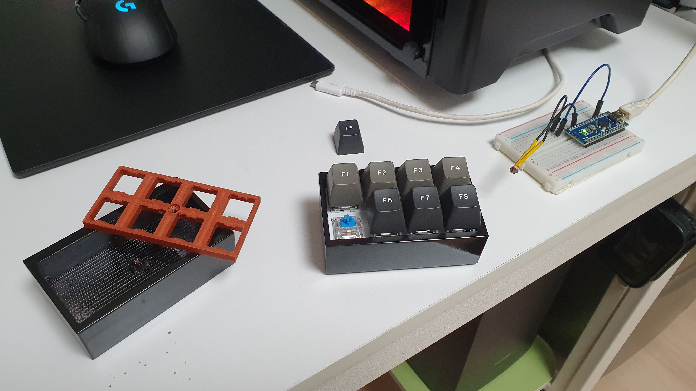

# Li-Fi Keyboard
### 아두이노 기반 LED 통신 무선 키보드 (Arduino based LED communication keyboard)

 

 

----------------------------------------
### Summary
[Google Drive](https://drive.google.com/drive/folders/1b7dvXcPiOU_c4KDfSVUqPuMRzktWuaV_?usp=sharing)

### 요구사항 (Requirement)
| Name                 | Description |
| -------------------- | :---------: |
| Arduino              |     2ea     |
| MX Compatible Switch |     8ea     |
| MX Compatible Keycap |     8ea     |
| BMS & LiPo           |      -      |
| CDS * 1ea            |      -      |
| 3mm Screw            |      -      |
| PLA Filament         |      -      |
| 3D Printer           |      -      |

-----------------------------------------------
