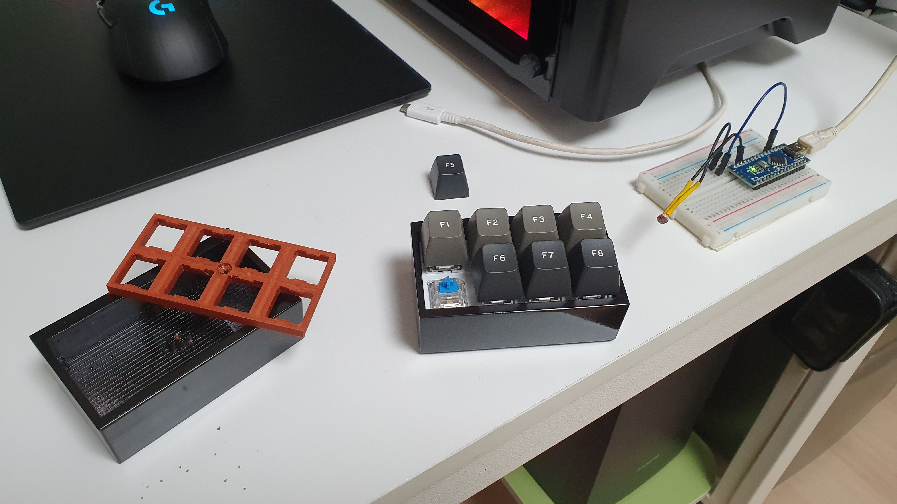

# Li-Fi Keyboard
### Arduino based LED communication keyboard

## Requirement
#### Arduino * 2ea
#### MX Compatible Switch * 8ea
#### MX Compatible Keycap * 8ea
#### LED * 1ea
#### CDS * 1ea
#### Wire
#### 3mm Screw
#### 3D Printer